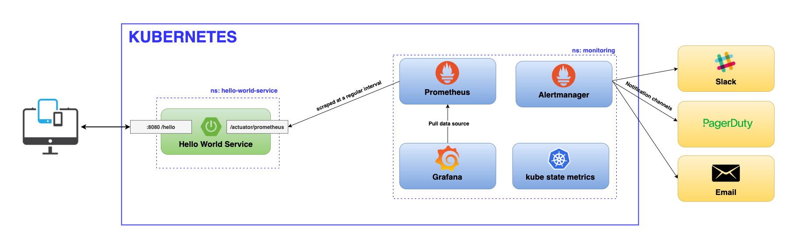
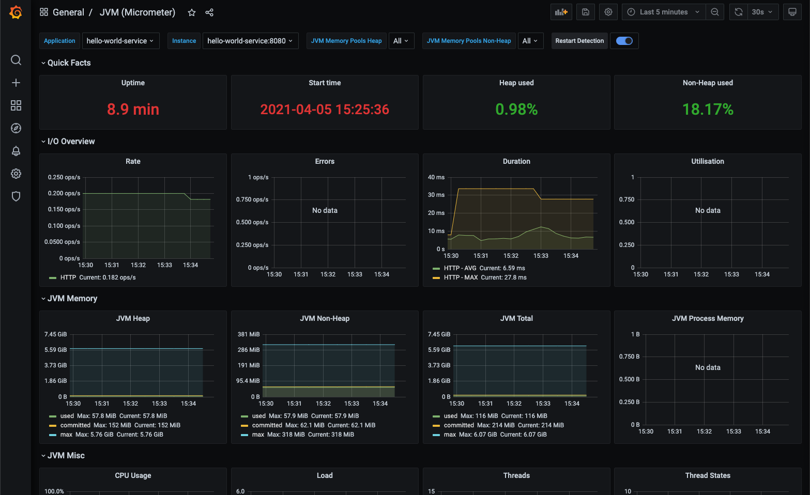
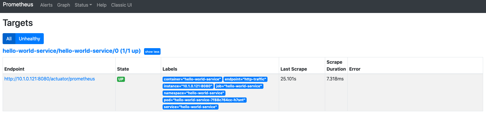

# Spring Boot Micrometer application with Prometheus Operator 

This repository contains sample Spring Boot application that exposes metrics to Prometheus and Grafana.

The goal of this project was to showcase how to collect and monitor application's metrics running inside kubernetes or docker compose. 

## Table of Content

- [Features](#features)
- [Architecture](#architecture)
- [Getting Started](#getting-started)
    * [Prerequisite](#prerequisite)
    * [Installation](#installation)
    * [Usage](#usage)
        + [Docker](#docker)
        + [Kubernetes](#kubernetes)
- [References](#references)
- [License](#license)

## Features

* Spring Boot Micrometer/Prometheus metrics integration.
* Docker compose Prometheus and Grafana set up.
* Kubernetes setup for running demo application with [Prometheus Operator](https://github.com/prometheus-operator/kube-prometheus).
* Service monitor [configuration](./k8s/service_monitor.yaml).

## Architecture



## Getting Started

### Prerequisite

* Java 11
* Docker
* Docker-Compose
* Kubernetes
* Helm

### Installation

Build docker image.

```shell
./gradlew bootBuildImage
```

### Usage

#### Docker

* Run docker-compose demo.
  ```shell
  docker-compose -f ./docker/docker-compose.yml up -d
  ```
* Check if all applications are running
    ```shell
    docker-compose -f ./docker/docker-compose.yml ps
  
           Name                      Command                  State               Ports         
    --------------------------------------------------------------------------------------------
    grafana               /run.sh                          Up (healthy)   0.0.0.0:3000->3000/tcp
    hello-world-service   /cnb/process/web                 Up             0.0.0.0:8080->8080/tcp
    prometheus            /bin/prometheus --config.f ...   Up (healthy)   0.0.0.0:9090->9090/tcp
    ```
  **** all services should be up and running

* Visit Prometheus [targets page](http://localhost:9090/targets) and check if *hello-world-service* scrapper is up and running.

* Open your web browser and go to Grafana [login page](http://localhost:3000/). On the login page, enter `admin` for username and password.
* Open http://localhost:3000/dashboard/import and import [JVM (Micrometer)](https://grafana.com/grafana/dashboards/4701)
  dashboard.
  


* Stop demo.
  ```shell
  docker-compose -f ./docker/docker-compose.yml down -v
  ```

#### Kubernetes

* Install **Prometheus Operator** inside **monitoring** namespace.
  
    * Install **helm**
      ```shell
      brew install helm
      ```
      
    * Add prometheus-community repo and update helm.
      ```shell
      helm repo add prometheus-community https://prometheus-community.github.io/helm-charts
    
      helm repo update
      ```
      
    * Create monitoring namespace inside kubernetes.
      ```shell
      kubectl create ns monitoring
      ```
      
    * Install operator
      ```shell
      helm install -n monitoring prometheus-operator prometheus-community/kube-prometheus-stack --set prometheus-node-exporter.hostRootFsMount=false
      ```
      *** --set prometheus-node-exporter.hostRootFsMount=false added to resolve this[issue](https://github.com/prometheus-community/helm-charts/issues/467).
    
* Start **hello-world** demo with **service-monitor**.
  
    * Create **hello-world-service** namespace.
        ```shell
        kubectl apply -f ./k8s/namespace.yml
        ```
  
    * Apply other k8s manifests.
        ```shell
        kubectl apply -f ./k8s 
        ```
  
* Port forward **Prometheus** and **Grafana** services.
    ```shell
    kubectl port-forward svc/prometheus-operated 9090:9090 -n monitoring
   
    kubectl port-forward svc/prometheus-operator-grafana 3000:80 -n monitoring
    ```
  
* Visit Prometheus [targets page](http://localhost:9090/targets) and check if *hello-world-service* scrapper is up and running.
    
    


* Open your web browser and go to Grafana [login page](http://localhost:3000/). On the login page, enter `admin` for username and `prom-operator` as a password.

* Import [JVM (Micrometer)](https://grafana.com/grafana/dashboards/4701) dashboard.

* Check all [dashboards](http://localhost:3000/dashboards) provided by Prometheus Operator.

* Uninstall demo from kubernetes environment.
    ```shell
    helm delete -n monitoring prometheus-operator
    
    kubectl delete ns monitoring
  
    kubectl delete all --all -n hello-world-service
  
    kubectl delete ns hello-world-service
    ```

## References

* [Micrometer](https://micrometer.io/)
* [Helm](https://github.com/helm/helm)
* [Prometheus](https://prometheus.io/)
* [kube-prometheus-stack](https://github.com/prometheus-community/helm-charts/tree/main/charts/kube-prometheus-stack)
* [kube-prometheus](https://github.com/prometheus-operator/kube-prometheus)
* [Grafana](https://grafana.com/)
* [Grafana Dashboard - JVM (Micrometer)](https://grafana.com/grafana/dashboards/4701)
* [Skaffold - Github releases](https://github.com/GoogleContainerTools/skaffold/releases)
* [Google Cloud - Cloud Code](https://cloud.google.com/code)

## License

Distributed under the MIT License. See `LICENSE` for more information.
